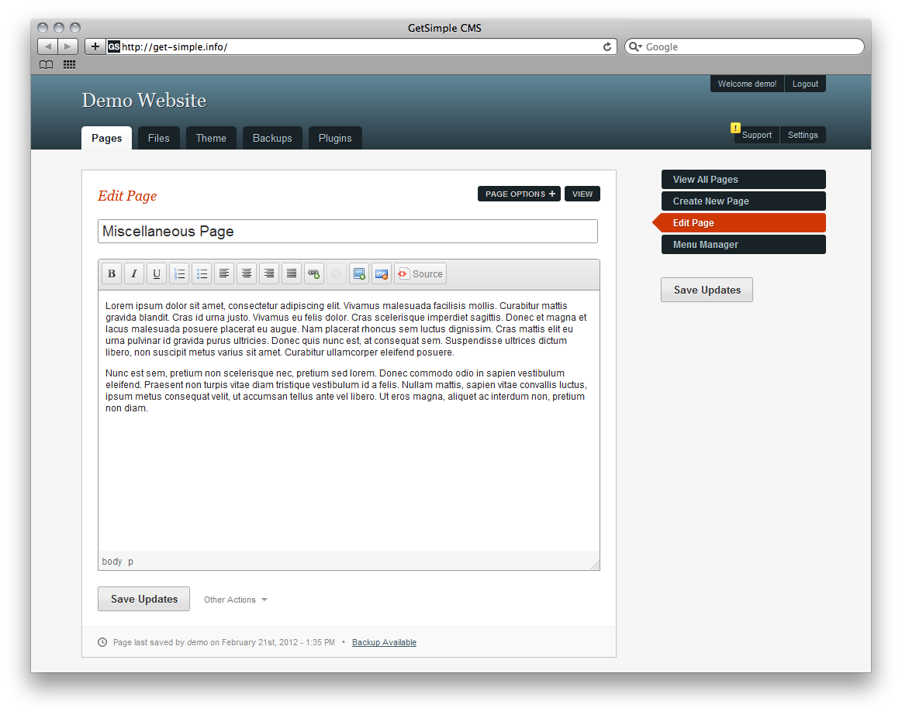

<!--
Ohart ongi: README hau automatikoki sortu da <https://github.com/YunoHost/apps/tree/master/tools/readme_generator>ri esker
EZ editatu eskuz.
-->

# GetSimple YunoHost-erako

[](https://dash.yunohost.org/appci/app/getsimple)  

[](https://install-app.yunohost.org/?app=getsimple)

*[Irakurri README hau beste hizkuntzatan.](./ALL_README.md)*

> *Pakete honek GetSimple YunoHost zerbitzari batean azkar eta zailtasunik gabe instalatzea ahalbidetzen dizu.*  
> *YunoHost ez baduzu, kontsultatu [gida](https://yunohost.org/install) nola instalatu ikasteko.*

## Aurreikuspena

GetSimple is an XML based, stand-alone, fully independent and lite Content Management System. To go along with its best-in-class user interface, we have loaded it with features that every website needs, but with nothing it doesn't. GetSimple is truly the simplest way to manage a small-business website.

### Features

- XML Based
- You can "Undo" Almost Everything
- Easy to Learn UI
- Simple Installation
- Simple Theme Customization
- Designed For the Small-Site Market

**Paketatutako bertsioa:** 3.3.16~ynh3

## Pantaila-argazkiak



## :red_circle: Ezaugarri zalantzagarriak

- **Jatorrizko garapena utzita**: Software honek ez du arduradunik. Denborak aurrera egin ahala funtzionatzeari utziko dio, konpondu gabeko segurtasun arazoak izango ditu, etab.

## Dokumentazioa eta baliabideak

- Aplikazioaren webgune ofiziala: <http://get-simple.info>
- Administratzaileen dokumentazio ofiziala: <http://get-simple.info/wiki/fr:start>
- Jatorrizko aplikazioaren kode-gordailua: <https://github.com/GetSimpleCMS/GetSimpleCMS>
- YunoHost Denda: <https://apps.yunohost.org/app/getsimple>
- Eman errore baten berri: <https://github.com/YunoHost-Apps/getsimple_ynh/issues>

## Garatzaileentzako informazioa

Bidali `pull request`a [`testing` abarrera](https://github.com/YunoHost-Apps/getsimple_ynh/tree/testing).

`testing` abarra probatzeko, ondorengoa egin:

```bash
sudo yunohost app install https://github.com/YunoHost-Apps/getsimple_ynh/tree/testing --debug
edo
sudo yunohost app upgrade getsimple -u https://github.com/YunoHost-Apps/getsimple_ynh/tree/testing --debug
```

**Informazio gehiago aplikazioaren paketatzeari buruz:** <https://yunohost.org/packaging_apps>
