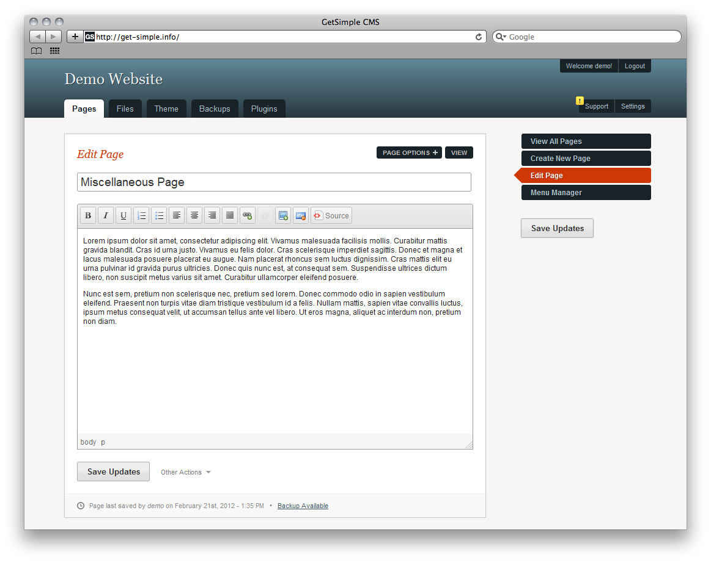

<!--
NB: Deze README is automatisch gegenereerd door <https://github.com/YunoHost/apps/tree/master/tools/readme_generator>
Hij mag NIET handmatig aangepast worden.
-->

# GetSimple voor Yunohost

[](https://ci-apps.yunohost.org/ci/apps/getsimple/)  

[](https://install-app.yunohost.org/?app=getsimple)

*[Deze README in een andere taal lezen.](./ALL_README.md)*

> *Met dit pakket kun je GetSimple snel en eenvoudig op een YunoHost-server installeren.*  
> *Als je nog geen YunoHost hebt, lees dan [de installatiehandleiding](https://yunohost.org/install), om te zien hoe je 'm installeert.*

## Overzicht

GetSimple is an XML based, stand-alone, fully independent and lite Content Management System. To go along with its best-in-class user interface, we have loaded it with features that every website needs, but with nothing it doesn't. GetSimple is truly the simplest way to manage a small-business website.

### Features

- XML Based
- You can "Undo" Almost Everything
- Easy to Learn UI
- Simple Installation
- Simple Theme Customization
- Designed For the Small-Site Market

**Geleverde versie:** 3.3.16~ynh5

## Schermafdrukken



## :red_circle: Anti-eigenschappen

- **Upstream not maintained**: This software is not maintained anymore. Expect it to break down over time, be exposed to unfixed security breaches, etc.

## Documentatie en bronnen

- Officiele website van de app: <http://get-simple.info>
- Officiele beheerdersdocumentatie: <http://get-simple.info/wiki/fr:start>
- Upstream app codedepot: <https://github.com/GetSimpleCMS/GetSimpleCMS>
- YunoHost-store: <https://apps.yunohost.org/app/getsimple>
- Meld een bug: <https://github.com/YunoHost-Apps/getsimple_ynh/issues>

## Ontwikkelaarsinformatie

Stuur je pull request alsjeblieft naar de [`testing`-branch](https://github.com/YunoHost-Apps/getsimple_ynh/tree/testing).

Om de `testing`-branch uit te proberen, ga als volgt te werk:

```bash
sudo yunohost app install https://github.com/YunoHost-Apps/getsimple_ynh/tree/testing --debug
of
sudo yunohost app upgrade getsimple -u https://github.com/YunoHost-Apps/getsimple_ynh/tree/testing --debug
```

**Verdere informatie over app-packaging:** <https://yunohost.org/packaging_apps>
